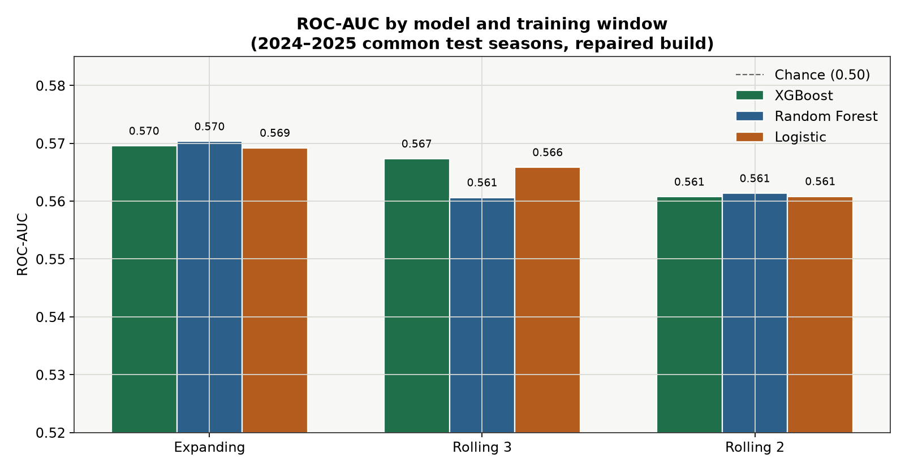
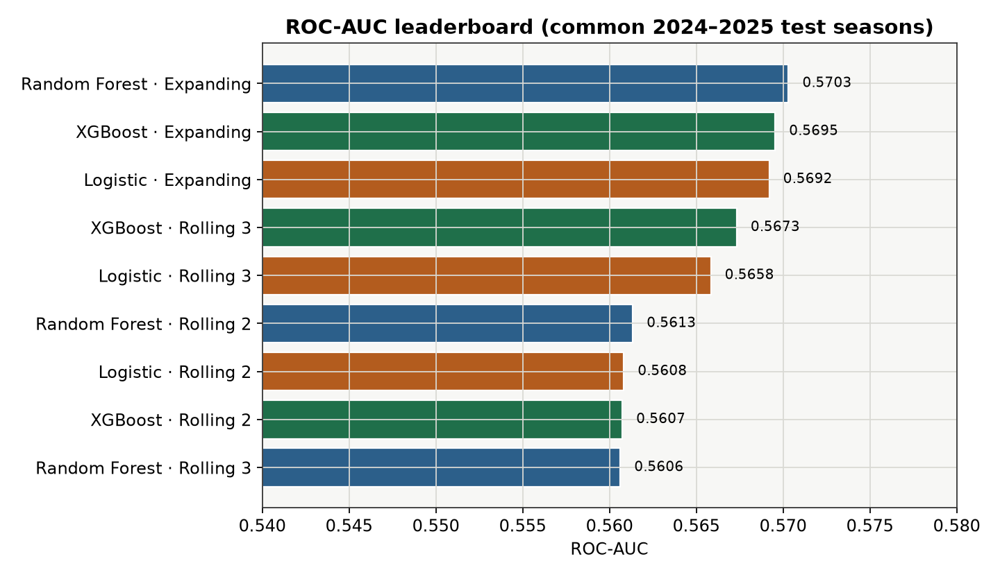
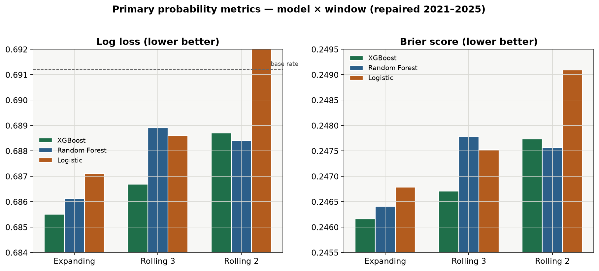
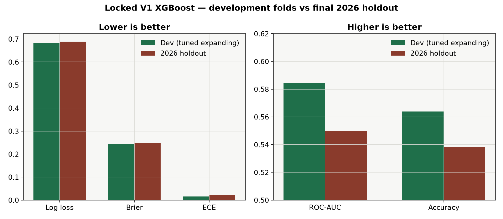

# MLB Moneyline Predictor

A local-first system that predicts **P(home team wins)** for MLB games, compares that probability to live sportsbook moneylines, and shows the edge on a Streamlit board.

It is built for trustworthy evaluation first: certified historical data, point-in-time features (no leakage), walk-forward model selection, and a one-shot untouched 2026 holdout. Betting-style ROI is secondary and never used to pick the model.

---

## What you get

| Piece | What it does |
|-------|----------------|
| **Historical pipeline** | Ingests MLB schedule + game details + odds into DuckDB, certifies the build, builds Gold features |
| **Model lab** | Trains logistic regression, random forest, and XGBoost under expanding / rolling windows |
| **Locked V1 model** | Tuned shallow XGBoost, expanding window, uncalibrated probs (ADR-006) |
| **Daily operator** | Refreshes today's starters, trains on 2021–2025 only, fetches live odds, writes predictions |
| **Streamlit app** | Signal-first homepage, daily board, model monitoring, shadow play challengers, per-game detail |
| **Read-only HTTP API** | Same artifact-backed daily board rows as JSON (`/docs` OpenAPI) |
| **Homelab automation** | Optional systemd timers for daily predictions + result enrichment (`docs/homelab-operations.md`) |

**Target:** binary home-team win probability.  
**Primary metrics:** log loss → Brier score → calibration (ECE).  
**Secondary metrics:** ROC-AUC, accuracy, simulated opening-market ROI.

---

## How it works (end to end)

```text
 MLB Stats API          The Odds API           Historical odds archive
       │                      │                          │
       ▼                      ▼                          ▼
  Raw / Bronze  ──immutable──▶  Silver (normalized)  ──▶  Gold (features)
                                                          │
                                                          ▼
                                              Walk-forward experiments
                                              (logistic / RF / XGBoost)
                                                          │
                                                          ▼
                                              ADR-006 lock → daily operator
                                                          │
                                                          ▼
                                              state/predictions/*.jsonl
                                                          │
                                    ┌─────────────────────┴─────────────────────┐
                                    ▼                                           ▼
                             Streamlit dashboards                    FastAPI read-only API
```

### 1. Data layers

| Layer | Role |
|-------|------|
| **Raw / Bronze** | Immutable API payloads (checksummed). Re-runs never mutate history. |
| **Silver** | Normalized tables: games, pitcher appearances, starters, team stats, odds snapshots. Canonical game id is MLB `game_pk` (not team+date — doubleheaders break that). |
| **Gold** | One feature row per game: team form + starter + bullpen, home/away + differentials. Target `home_win` is stored separately from features. |

Certification (`src/validation/`, `state/data-certifications/`) is a hard gate: incomplete or conflicting Silver data fails before model work proceeds.

### 2. Features (point-in-time)

Every feature for a game must be knowable **before first pitch** of that game (ADR-002):

- Rolling stats **shift before roll** — the current game never enters its own averages.
- Starter features use probable/actual pitcher ids known at prediction time; first-start / missing / changed-starter cases are explicit.
- Bullpen features use prior 1/3-day workload and recent ERA/WHIP, ordered correctly for same-day doubleheaders.
- Odds used as model inputs (or for edge) must have `snapshot_timestamp < prediction_timestamp < first_pitch`. Closing odds are post-hoc only unless you literally predict at close.

~**240** Gold columns on the repaired 2021–2025 build (team + starter + bullpen, home/away/diff).

### 3. Models

Three families share one contract (`build_model` / `predict_proba` / `model_metadata`):

| Family | Module |
|--------|--------|
| Logistic regression | `src/models/logistic.py` |
| Random forest | `src/models/random_forest.py` |
| XGBoost | `src/models/xgboost_model.py` |

Training windows compared:

- **Expanding** — train on all prior seasons in the fold, test the next season(s)
- **Rolling 2-season** / **Rolling 3-season** — train only on the most recent N seasons

**2026 is never used for selection or tuning.** It is the final holdout.

### 4. Daily prediction run

`scripts/daily_predictions.py`:

1. Fit the ADR-006 locked XGBoost on **2021–2025 only** (never today / never 2026 completed games for training).
2. Optionally refresh today's MLB game-detail payloads so probable starters are current (PIPE-005).
3. Build inference Gold features for games with **both** starters announced.
4. Fetch live moneylines (The Odds API).
5. Set `prediction_timestamp` **after** odds fetch (so fresh odds are not treated as “from the future”).
6. Append immutable prediction rows to `state/predictions/daily.jsonl` with model prob, no-vig market prob, and edge.

**Monte Carlo simulation is off by default.** The Poisson score-model path (`src/simulation/`) remains in the repo for research, but the daily operator does not fit it or write `simulation.jsonl` unless you pass `--enable-simulation`. See [Monte Carlo (paused)](#monte-carlo-simulation-paused).

Skipped games get an explicit reason (`prediction_not_before_first_pitch`, missing starters, odds timing, etc.).

### 5. Edge vs market

American odds → implied probability → two-way **no-vig** market probability (sums to 1).  
**Edge** = model P(home) − market P(home) (home-relative; the picked side depends on which layer you read).

Three layers are kept separate on purpose:

| Layer | What it is | Official pick? |
|-------|------------|----------------|
| **Model** | Stored `model_probability` = P(home wins) | N/A — probability only |
| **Market** | No-vig implied P(home) from live odds | N/A — benchmark only |
| **Baseline PLAY/PASS** | `abs(edge) ≥ 2%` display threshold (`DEFAULT_EDGE_THRESHOLD`) | **Yes** — still the main daily-board label |
| **MARKET-004 shadow** | Uncertainty-adjusted challenger (raw model favorite + Wilson buckets) | **No** — compare only |
| **MARKET-005 shadow** | Consensus-confirmed challenger (model + market agree on direction) | **No** — compare only |

Baseline PLAY follows **edge sign** (can differ from the raw model favorite). The shadow challengers are read-only diagnostics inspired by ML-013 / ML-015: large model–market disagreement often underperforms, while the 2% edge rule was never a validated staking policy. See [Shadow play challengers](#shadow-play-challengers-read-only) below.

---

## Recent dashboard & monitoring updates

### APP-013 — signal-first homepage

The Streamlit home page is now a **daily signal dashboard** (`streamlit_app.py`, `src/app/signal_dashboard.py`):

- System status, today's edge summary, and a sortable signal table
- Risk flags (stale odds, missing data, large disagreement, game timing)
- Selected-game drill-down with feature context
- Edge distribution buckets and a short model-quality snapshot
- Finished PLAY results kept separate from probability-quality evidence

Dedicated sidebar pages split observability by question:

| Page | Purpose |
|------|---------|
| **Daily Predictions** | Full slate with PLAY/PASS and timestamps |
| **Model Quality** | Holdout + development + daily live monitoring (APP-014) |
| **Market Edge** | Model-vs-market disagreement views |
| **Betting Results** | PLAY win rate / flat-stake ROI (not model evidence) |
| **Prospective Evaluation** | Frozen production monitoring |
| **Game Detail** | Per-game features + multi-book odds (incl. Kalshi when captured) |
| **Parlay Builder** | Experimental 2/3/4-leg parlay suggestions from ranked legs (APP-015; not PLAY policy) |

### APP-014 — professor-readable model monitoring

`src/app/model_quality_page.py` adds a clearer **Model Quality** tab:

- **Model Evidence** — locked 2026 holdout vs repaired 2021–2025 development metrics
- **Daily Monitoring** — artifact-backed live log loss / Brier / ECE by slate date
- **Trust & Model Evidence** — methodology boundaries (uncalibrated V1, no ROI-as-quality)

Daily monitoring uses the latest prediction per `game_pk`, excludes pending games from win-rate math, and never mixes betting selection into probability-quality tables.

### ML-015 — prospective live diagnostic

First weeks of real production predictions (`docs/research/ml-015-prospective-model-market-diagnostic.md`):

- Core model discrimination (ROC-AUC) matched the 2026 holdout — no broad model-quality failure
- PLAY shortfall traced mainly to **edge-sign crossover** (PLAY side ≠ raw model favorite) and high-disagreement buckets
- Conclusion: **market / PLAY layer more concerning than the locked model** — motivates shadow challengers, not a model retune

### Shadow play challengers (read-only)

Both run at **display time** from existing `daily.jsonl` + `journal.jsonl`. **No model re-run required.**

**MARKET-004 — uncertainty-adjusted** (`src/app/uncertainty_challenger.py`)

- Side = **raw model favorite** (P(home) ≥ 50% → home, else away)
- Gates: favorite ≥ 55%, favorite edge ≥ 3%, Wilson lower bound still beats market, positive lower-bound EV, bucket N ≥ 30
- Homepage section: **Uncertainty-Adjusted Signals** (CANDIDATE / WATCH)
- Shadow backtest uses point-in-time resolved history (first pitch before decision time)

**MARKET-005 — consensus-confirmed** (`src/app/consensus_strategy.py`)

- Side = **raw model favorite** when model and market **agree on direction** (or market is neutral within 2 pp)
- Gates: selected-side model P ≥ 55%, edge ≥ 1%, fresh odds, no major data warnings
- Large disagreement (≥ 8 pp) stays a **review flag**, not automatic value
- Included in **Shadow strategy comparison** on the homepage and Betting Results page

**Policy (Option A):** baseline **2% PLAY/PASS is unchanged** and remains the official board label. Shadow rows are for side-by-side comparison only.

Restart Streamlit after pulling code updates:

```bash
sudo systemctl restart mlb-streamlit.service   # homelab
# or: python -m streamlit run streamlit_app.py
```

### Kalshi pregame capture (optional)

`scripts/kalshi_pregame_capture.py` stores Kalshi MLB prices near first pitch; they appear in the Game Detail multi-book table alongside sportsbooks. Scheduler wiring is operator-side (`docs/homelab-operations.md`).

---

## Model statistics

### How to read the metrics

| Metric | Better when… | Why we care |
|--------|--------------|-------------|
| **Log loss** | Lower | Penalizes confident wrong probs — primary ranking key |
| **Brier score** | Lower | Mean squared error of probabilities |
| **ECE** | Lower | Expected calibration error (reliability of stated probs) |
| **ROC-AUC** | Higher | Ranking quality (secondary — not used to pick V1) |
| **Accuracy** | Higher | Hard 50% threshold — secondary |

Base-rate reference (home wins ~53%): log loss ≈ **0.691**, Brier ≈ **0.249**. Anything below that is a real (often small) probability edge.

Charts below are generated from the committed experiment JSONs via
`scripts/generate_readme_charts.py`.

---

### Head-to-head: models × windows (repaired 2021–2025)

Certified build `a910017bac839af5` — full team + starter + bullpen features.  
Ranked on common test seasons **{2024, 2025}** (~4,847 games each).  
Primary order: log loss → Brier → ECE. Report: `reports/experiments/v1-repaired-a910017bac839af5.json`.







| Rank | Model | Window | Log loss ↓ | Brier ↓ | ECE ↓ | **ROC-AUC ↑** | Accuracy |
|------|-------|--------|------------|---------|-------|---------------|----------|
| 1 | **XGBoost** | expanding | **0.68551** | **0.24616** | 0.0298 | 0.5695 | 0.5457 |
| 2 | Random forest | expanding | 0.68613 | 0.24641 | **0.0231** | **0.5703** | 0.5544 |
| 3 | XGBoost | rolling 3 | 0.68669 | 0.24671 | 0.0251 | 0.5673 | 0.5509 |
| 4 | Logistic | expanding | 0.68711 | 0.24679 | 0.0329 | 0.5692 | 0.5560 |
| 5 | Random forest | rolling 2 | 0.68841 | 0.24757 | 0.0252 | 0.5613 | 0.5478 |

**Takeaways**

- Expanding windows beat rolling windows for the top families.
- XGBoost wins on primary probability metrics; random forest is close and slightly higher AUC / better ECE here.
- All models beat the base-rate log loss (~0.691) by a **small** amount — MLB moneylines are efficient; expect modest edges, not huge AUCs.

ROC-AUC in the high-0.55s means the model ranks winners better than chance, but is **not** a strong classifier by typical ML leaderboard standards. That is expected for liquid sports markets.

---

### Locked V1 model (after XGBoost tuning)

20-candidate shallow XGBoost grid on expanding folds only (2026 never inspected).  
ADR-006 locks this configuration.

| Hyperparameter | Value |
|----------------|-------|
| `max_depth` | 2 |
| `learning_rate` | 0.03 |
| `n_estimators` | 300 |
| `reg_lambda` | 10.0 |
| `min_child_weight` | 3.0 |
| `subsample` / `colsample_bytree` | 0.8 / 0.8 |
| Window | Expanding |
| Calibration | **Uncalibrated** (raw probabilities) |

**Expanding-fold aggregate (tuned, full-train per fold)** — 9,694 test games:

| Log loss | Brier | ECE | **ROC-AUC** | Accuracy |
|----------|-------|-----|-------------|----------|
| **0.68124** | **0.24408** | **0.01578** | **0.58446** | **0.56396** |

vs untuned XGBoost/expanding on the same repaired comparison (~0.6855 log loss / ~0.570 AUC): tuning improved both probability quality and ranking.

**Calibration note:** Platt/sigmoid improved ECE a lot (≈0.006) with nearly identical log loss, but the **raw** full-train tuned model still won the strict log-loss/Brier ranking. ADR-006 therefore keeps uncalibrated probs.

Report: `reports/experiments/v1-repaired-xgboost-tuning-a910017bac839af5.json`.

---

### Final 2026 holdout (one evaluation)

Trained on 2021–2025 only (`n_train = 12,118`), tested on completed 2026 regular-season games (`n_test = 1,797`).  
Report: `reports/experiments/v1-holdout-2026.json`.



| Metric | Holdout 2026 | Tuned expanding (dev) |
|--------|--------------|------------------------|
| Log loss | **0.68878** | 0.68124 |
| Brier | **0.24781** | 0.24408 |
| ECE | **0.02224** | 0.01578 |
| **ROC-AUC** | **0.54968** | 0.58446 |
| Accuracy | **0.53812** | 0.56396 |

Holdout is weaker than development folds (mild overfit / season shift / harder slate). Methodology is **locked** — do not re-tune on 2026 (ADR-006).

---

### Diagnostic-only: first experiment (team features only)

Build `7225f7f46a5e27e9` had **empty starter/bullpen pitching signal** (DATA-016 defect). Numbers are historical context only — **not** used for the V1 lock.

| Rank | Model | Window | Log loss | Brier | ECE | **ROC-AUC** | Accuracy |
|------|-------|--------|----------|-------|-----|-------------|----------|
| 1 | Logistic | expanding | 0.68395 | 0.24545 | 0.0169 | 0.5662 | 0.5516 |
| 2 | Logistic | rolling 3 | 0.68496 | 0.24594 | 0.0180 | 0.5626 | 0.5495 |
| 4 | XGBoost | expanding | 0.68732 | 0.24706 | 0.0252 | 0.5604 | 0.5448 |

Without pitching features, the linear model looked best. After the repaired ingest restored starters/bullpens, **XGBoost took the lead** — which is what V1 ships.

---

## Architecture decisions (short)

| ADR | Decision |
|-----|----------|
| ADR-001 | DuckDB + Parquet local storage |
| ADR-002 | Point-in-time correctness; prediction before first pitch |
| ADR-003 | Walk-forward validation; primary = log loss / Brier / calibration |
| ADR-004 / 005 | Historical certification + defense in depth |
| ADR-006 | Lock tuned XGBoost + expanding + uncalibrated |

Full write-ups: `docs/decisions/`.

---

## Repository map

```text
src/
  ingestion/     MLB + odds + Kalshi fetchers, immutable raw storage
  transforms/    Silver normalization
  features/      Team / starter / bullpen / Gold matrix
  models/        Logistic, RF, XGBoost
  evaluation/    Splits, metrics, calibration, holdout helpers
  experiments/   Expanding / rolling / comparison runners
  market/        American odds → no-vig probs + edge
  pipelines/     Daily prediction contract
  app/           Streamlit pages + signal dashboard + shadow challengers
  api/           Read-only FastAPI (artifact-backed JSON)
  validation/    Certification & leakage checks
scripts/
  daily_predictions.py          Live daily operator
  enrich_prediction_results.py  Post-game journal enrichment (wins/losses on board)
  run_daily_operator.py         Homelab wrapper (schedule refresh → predict → enrich)
  kalshi_pregame_capture.py     Optional Kalshi prices near first pitch
  run_api.py                    Start uvicorn for the read-only API
  smoke_sim_yesterday.py        Offline Monte Carlo smoke on a past slate (research)
  holdout_2026.py               One-shot holdout evaluation
  generate_readme_charts.py     Rebuild docs/images/*.png from experiment JSON
state/
  CURRENT.md             Project status
  data-certifications/   PASS/FAIL artifacts
  predictions/           Local daily JSONL (gitignored)
reports/
  experiments/           Model comparison + holdout JSON
docs/
  api.md                 HTTP API reference (endpoints, config, examples)
  decisions/             ADRs
  research/              ML-012/013/015 diagnostic write-ups
  homelab-operations.md  Systemd timers + secrets layout
  images/                README charts
.github/
  README.md              GitHub repo guide (links, dev setup, API summary)
tasks/                   Task graph for agents / contributors
```

Local DuckDB lives at `data/mlb.duckdb` (gitignored, ~1GB). Copy it between machines or rebuild via ingestion scripts.

---

## Quick start

### Requirements

- Python 3.11+ recommended  
- Dependencies: `pip install -r requirements.txt` (editable install includes the `app` extra for Streamlit)  
- `THE_ODDS_API_KEY` for live odds  
- A local certified DuckDB build under `data/`

### Environment

Create `.env` in the repo root (gitignored):

```env
THE_ODDS_API_KEY=paste_your_key_here
```

PowerShell (load `.env` into the current session):

```powershell
Get-Content .env | ForEach-Object {
  if ($_ -match '^\s*([^#][^=]+)=(.*)$') {
    [Environment]::SetEnvironmentVariable($matches[1].Trim(), $matches[2].Trim(), "Process")
  }
}
```

Activate the project venv if you use one:

```powershell
.\.venv\Scripts\Activate.ps1
```

### Day-to-day commands

**1. Run today's predictions** (XGBoost moneyline + market edge; Monte Carlo skipped):

```powershell
python scripts\daily_predictions.py --date 2026-08-14
```

Skip MLB game-detail refresh when starters were already updated earlier today:

```powershell
python scripts\daily_predictions.py --date 2026-08-14 --skip-detail-refresh
```

**2. After games finish — enrich results** (powers win/loss on the board and homepage):

```powershell
python scripts\enrich_prediction_results.py --date 2026-08-14
```

### Automated homelab operator

The stable Linux automation entrypoint is:

```bash
python scripts/run_daily_operator.py --stage all
```

It refreshes the target-day MLB schedule, normalizes the current slate, runs
pregame predictions, and enriches completed results through the existing
append-only operators. Production systemd units and the complete secrets,
installation, scheduling, logging, rerun, and shutdown instructions are in
[`docs/homelab-operations.md`](docs/homelab-operations.md).

**3. Open the dashboard:**

```powershell
python -m streamlit run streamlit_app.py
```

Homelab (after code updates):

```bash
sudo systemctl restart mlb-streamlit.service
```

**4. Read-only JSON API** (optional; same artifacts as the dashboard):

```powershell
pip install -e ".[app,api]"
python -m uvicorn api.main:app --reload --port 8000
```

Open http://127.0.0.1:8000/docs for interactive OpenAPI docs. Full reference: [`docs/api.md`](docs/api.md). GitHub browsing guide: [`.github/README.md`](.github/README.md).

The API is read-only — run `daily_predictions.py` first so `state/predictions/daily.jsonl` exists.

**Homepage** (`streamlit_app.py`) — signal dashboard with baseline signals, uncertainty-adjusted shadow table, and resolved strategy comparison.

**Sidebar pages:**

- **Daily Predictions** — today's slate (model, market, edge, PLAY/PASS)
- **Model Quality** — holdout + development + daily live probability monitoring (APP-014)
- **Market Edge** — model-vs-market disagreement
- **Betting Results** — PLAY win rate, flat-stake ROI, shadow strategy comparison
- **Prospective Evaluation** — frozen production monitoring
- **Game Detail** — per-game features and multi-book odds (DraftKings, Kalshi, etc.)
- **About** — plain-English methodology

**5. Rebuild README charts** (optional, after experiment JSON changes):

```powershell
python scripts\generate_readme_charts.py
```

### Operator outputs

| File | Contents |
|------|----------|
| `state/predictions/daily.jsonl` | Append-only predictions (latest row per `game_pk` on the board) |
| `state/predictions/game_features.jsonl` | Feature snapshot per game |
| `state/predictions/odds_books.jsonl` | Multi-book comparison odds |
| `state/predictions/skipped.jsonl` | Games waiting on starters / other skips |
| `state/predictions/journal.jsonl` | Post-game enrichment (correct / actual winner) |

`simulation.jsonl` is **not** written unless you opt in with `--enable-simulation`.

### Monte Carlo simulation (paused)

V2 added a game-level Monte Carlo layer: fit Poisson run-rate models on Gold features, sample home/away runs, derive win and total-run distributions. After smoke-testing the **2026-08-13** slate, we **disabled it in the default daily operator**:

- Sim expected totals clustered around **8–9 runs** for almost every game.
- Blowouts and low-scoring games were missed badly (e.g. SEA@NYY actual **1** run; CIN@CWS actual **17**).
- Moneyline picks often disagreed with the locked XGBoost model without clear benefit.
- Each run added **minutes** of Poisson fitting on 240 features plus sklearn convergence warnings.

![Monte Carlo smoke: sim E[total] vs actual totals on 2026-08-13](docs/images/monte_carlo_smoke_totals.png)

The code under `src/simulation/` stays for research. To run an offline smoke on a past slate:

```powershell
python scripts\smoke_sim_yesterday.py --date 2026-08-13 --count 8
```

To write `simulation.jsonl` from the daily operator (not recommended for routine use):

```powershell
python scripts\daily_predictions.py --date 2026-08-14 --enable-simulation
```

**Production path:** ADR-006 XGBoost moneyline + market edge only.

---

## Read-only HTTP API

Minimal FastAPI v1 over `app.board.load_daily_board` — same board rows as the Streamlit daily page, no recompute at the HTTP layer.

| Endpoint | Purpose |
|----------|---------|
| `GET /health` | Liveness |
| `GET /v1/predictions/today` | Latest slate |
| `GET /v1/predictions?date=YYYY-MM-DD` | One slate |
| `GET /v1/predictions/{game_pk}` | Single game (`?date=` optional) |

**Docs:** [`docs/api.md`](docs/api.md) · [`.github/README.md`](.github/README.md) · live Swagger at `/docs`.

**Config:** `PREDICTIONS_STORE_PATH`, `PREDICTION_JOURNAL_PATH`; set `CORS_ORIGINS` (comma-separated) only when a browser frontend needs it — CORS is off by default.

**Not in v1:** auth, POST triggers, slate listing, summary, best plays, feature breakdown.

---

## Design principles worth remembering

1. **Never train or select on the final holdout (2026).**  
2. **Never use a game's own result or future stats in its features.**  
3. **Probability quality > accuracy > simulated ROI.**  
4. **Raw API data is immutable; ingestion is idempotent.**  
5. **Skipped predictions must say why** — silent drops are bugs.  
6. **UI “PLAY” is not bankroll advice** — baseline 2% edge is display-only; shadow challengers (MARKET-004/005) are diagnostic, not production picks.

---

## Key artifacts

| Artifact | Path |
|----------|------|
| Project state | `state/CURRENT.md` |
| V1 methodology lock | `docs/decisions/ADR-006-v1-methodology-lock.md` |
| Repaired 2021–2025 certification | `state/data-certifications/certification-PASS-a910017bac839af5.json` |
| 2021–2026 / holdout certification | `state/data-certifications/certification-PASS-db7dbc8b8a1c5ae9.json` |
| Model comparison (repaired) | `reports/experiments/v1-repaired-a910017bac839af5.json` |
| XGBoost tuning | `reports/experiments/v1-repaired-xgboost-tuning-a910017bac839af5.json` |
| 2026 holdout report | `reports/experiments/v1-holdout-2026.json` |
| Gold completeness | `reports/data-quality/gold-completeness-a910017bac839af5.json` |
| ML-015 prospective diagnostic | `docs/research/ml-015-prospective-model-market-diagnostic.md` |
| ML-013 failure regimes | `docs/research/ml-013-failure-regime-and-redundancy.md` |
| Homelab operations | `docs/homelab-operations.md` |
| Task index | `tasks/index.md` |
| HTTP API reference | `docs/api.md` |
| GitHub repo guide | `.github/README.md` |

---

## Status

V1 historical + model work is **complete**. The daily operator, signal dashboard, shadow play challengers (MARKET-004/005), and read-only HTTP API are the main day-to-day surfaces.

**Recently shipped:** APP-013 signal homepage, APP-014 model monitoring tab, ML-015 live diagnostic, MARKET-004 uncertainty shadow, MARKET-005 consensus shadow, Kalshi pregame capture, homelab systemd automation (OPS-001).

Optional follow-ups (data retries, persisted market reports, simulation validation) live in `tasks/index.md` and `state/CURRENT.md`.
